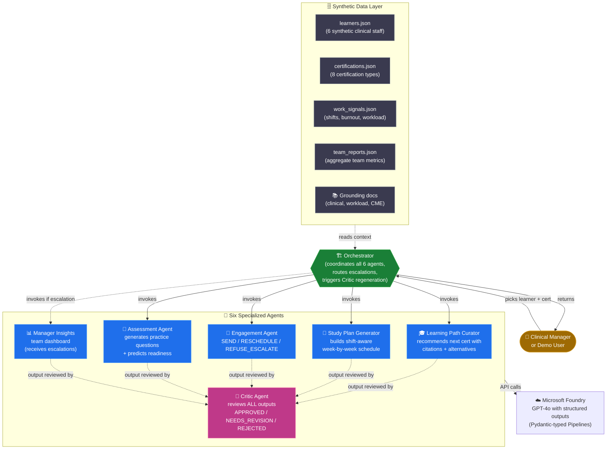
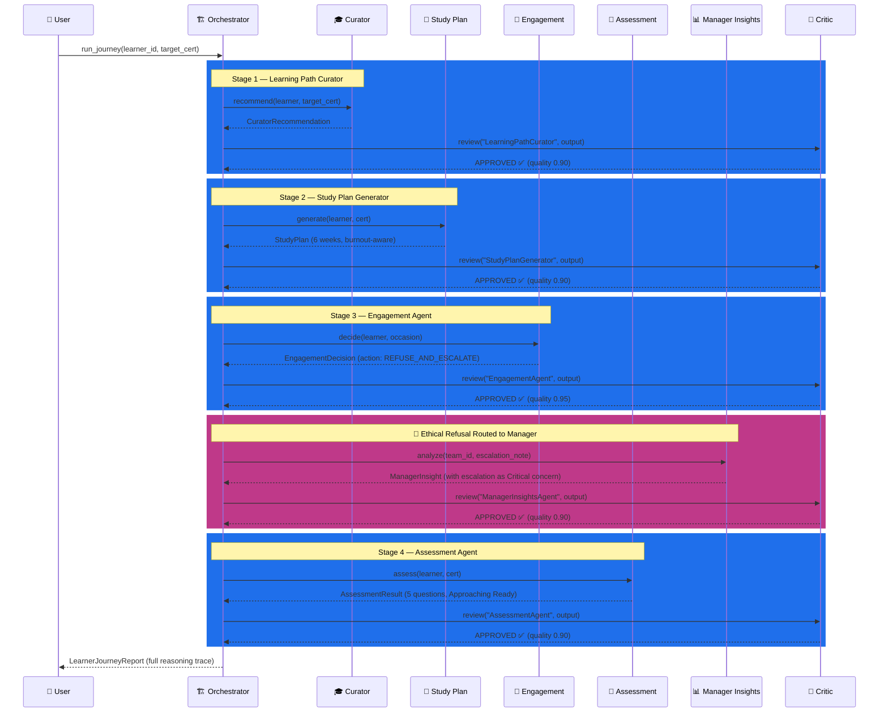
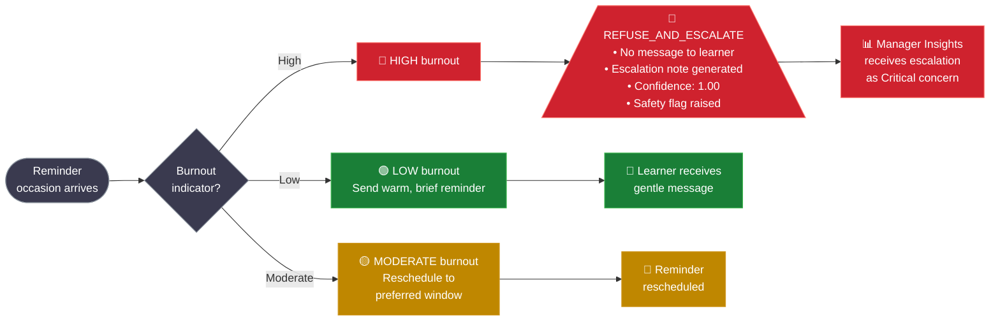
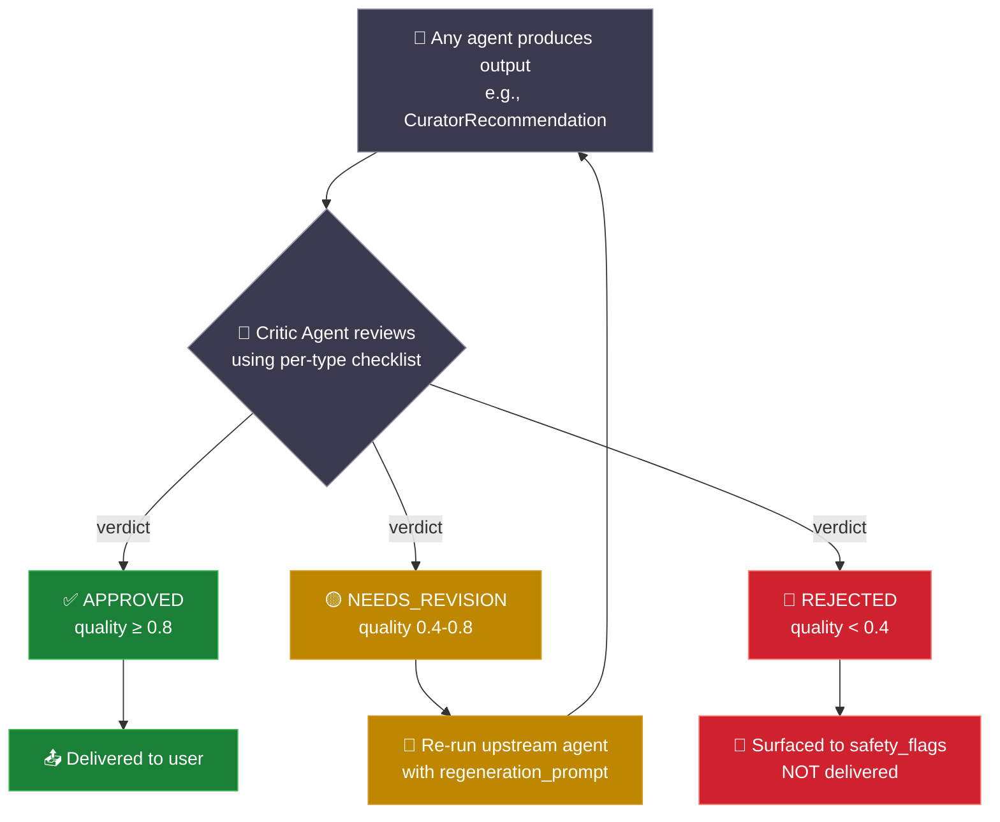

# MedLearn AI — Architecture

> A multi-agent system for healthcare workforce certification, built for the Microsoft Agents League Hackathon 2026 (Reasoning Agents track).

---

## 🏗️ System Overview

MedLearn AI is a coordinated team of **6 specialized AI agents** that reason together about a hospital's clinical learning operations. Each agent is a single-purpose reasoning engine with structured Pydantic output, citations, and confidence scoring. A **Critic Agent** reviews every output before delivery, and an **Orchestrator** routes data between agents — including ethical escalations when the Engagement Agent refuses to push burnt-out staff.



---

## 🔄 Pipeline Flow (Detailed)

The Orchestrator runs all 6 agents in sequence, with the Critic reviewing each output. When the Engagement Agent refuses to send a reminder (high-burnout learner), the Orchestrator routes the escalation to Manager Insights — closing the ethical loop in code.



---

## 🛑 The Ethical Refusal Pattern

MedLearn AI's signature behavior: the Engagement Agent **refuses to send study reminders to high-burnout learners**, regardless of deadline urgency. Instead, the case is escalated to a manager for workload review. This is duty-of-care in code.



---

## 🧪 The Self-Correction Loop (Critic Regeneration)

Every agent's output passes through the Critic Agent before being delivered. The Critic uses **per-type checklists** to find specific failure modes (citation hallucinations, math errors, missing safety flags, ethical violations). When the Critic returns `NEEDS_REVISION`, the Orchestrator re-runs the upstream agent with the Critic's feedback.



---

## 📦 V1.5 Differentiators

These are the design decisions that set MedLearn AI apart from typical multi-agent submissions:

| # | Differentiator | Implementation |
|---|---|---|
| 1 | **Visible reasoning** | Every agent output includes `rationale`, `confidence`, `citations`, and `alternatives_considered` fields |
| 2 | **Ethical refusal** | Engagement Agent's `REFUSE_AND_ESCALATE` action; no message sent to learner, escalation routed to manager |
| 3 | **Inter-agent escalation** | Engagement Agent's refusal automatically triggers Manager Insights Agent through the Orchestrator |
| 4 | **Self-correction loop** | Critic Agent reviews all outputs with per-type checklists; triggers regeneration with feedback |
| 5 | **Burnout-aware intensity** | Study Plan Generator caps weekly hours at 40% of focus capacity for high-burnout learners |
| 6 | **Aggregate-only manager views** | Manager Insights uses team-level data and never names individuals (privacy compliance) |
| 7 | **Confidence calibration** | Critic flags incoherent outputs (e.g., high confidence + safety flags = quality reduction) |

---

## 🛠️ Tech Stack

| Layer | Technology |
|---|---|
| 🤖 LLM | GPT-4o (deployed in Microsoft Foundry, East US 2) |
| 🐍 Language | Python 3.12 |
| 📜 Framework | Microsoft Agent Framework v1.7.0 |
| 📋 Validation | Pydantic (structured outputs via `client.beta.chat.completions.parse()`) |
| 🖥️ UI | Streamlit |
| ☁️ Hosting | Microsoft Foundry + Azure subscription |
| 📊 API version | `2024-12-01-preview` (required for structured outputs) |

---

## 🗂️ File Layout

```
medlearn-ai/
├── medlearn/                       # Core package (renamed from 'agents/' to avoid pip collision)
│   ├── orchestrator.py             # Coordinates all 6 agents + regen loops + escalation
│   ├── learning_path_curator.py    # Agent 1
│   ├── study_plan_generator.py     # Agent 2
│   ├── engagement_agent.py         # Agent 3 (ethical refusal)
│   ├── assessment_agent.py         # Agent 4
│   ├── manager_insights_agent.py   # Agent 5 (escalation receiver)
│   ├── critic_agent.py             # Agent 6 (reviews 1-5)
│   ├── grounding.py                # Loads .md grounding docs
│   ├── data_loader.py              # Reads synthetic data files
│   └── models/
│       ├── agent_response.py       # All structured-output Pydantic schemas
│       ├── learner.py / certification.py / work_signal.py / team_report.py
│       └── enums.py
├── data/                           # Synthetic data + grounding docs
│   ├── learners.json
│   ├── certifications.json
│   ├── work_signals.json
│   ├── team_reports.json
│   └── docs/
│       ├── clinical_certification_guide.md
│       ├── workload_correlation_report.md
│       └── cme_compliance_handbook.md
├── scripts/                        # Smoke tests (one per agent + orchestrator)
│   ├── test_curator.py
│   ├── test_study_plan.py
│   ├── test_engagement.py
│   ├── test_assessment.py
│   ├── test_manager_insights.py
│   ├── test_critic.py
│   └── test_orchestration.py
├── tests/                          # Pydantic schema + data integrity tests
│   └── test_data_loading.py
├── docs/
│   └── architecture.md             # ← You are here
├── medlearn_ui.py                  # Streamlit demo UI (project root)
├── requirements.txt
├── .env                            # gitignored — Foundry credentials
└── README.md
```

---

## ⚙️ Quick Start

```bash
# 1. Install dependencies
pip install -r requirements.txt

# 2. Configure .env with your Foundry credentials
#    AZURE_AI_PROJECT_ENDPOINT=https://...
#    AZURE_AI_API_KEY=...
#    AZURE_AI_MODEL_DEPLOYMENT=medlearn-gpt-4o

# 3. Run end-to-end pipeline
python -m scripts.test_orchestration

# 4. Launch the demo UI
streamlit run medlearn_ui.py
```

---

*MedLearn AI — Reasoning, citing, reviewing, and ethical. Built for the Microsoft Agents League Hackathon 2026.*
